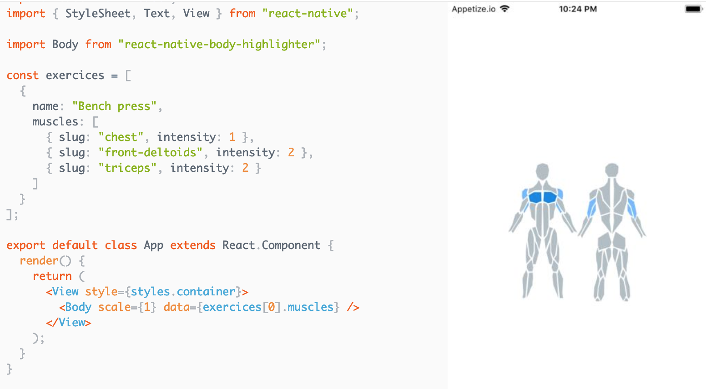

# react-native-body-highlighter

[](https://www.npmjs.com/package/react-native-body-highlighter) [](https://www.npmjs.com/package/react-native-body-highlighter) [](https://www.npmjs.com/package/react-native-body-highlighter)

> Simple body muscles highlighter for react-native.

## Installation

```bash
$ npm install react-native-body-highlighter --save
```

or use yarn

```bash
$ yarn add react-native-body-highlighter
```

## Usage

Note: If you don't use `Expo`, ensure to add [react-native-svg](https://github.com/react-native-community/react-native-svg) to your project before using this package.

The snippet below shows how the component can be used

<div style="text-align: center;">

</div>

## Props

| Prop   | Required | Purpose                                      |
| ------ | -------- | -------------------------------------------- |
| data   | Yes      | (Array) Array of MuscleObject to highlight   |
| colors | No       | (Array) Defaults to `['#0984e3', '#74b9ff']` |
| scale  | No       | (Float) Defaults to 1                        |

## Muscle object model

- #### MucleObject : `{ slug: MuscleName, intensity: IntensityNumber }`

- #### MuscleName : Muscle name to highlight (See the list of available muscles below)

- #### IntensityNumber : Color of highlight

## List of muscles

```Javascript
// Back
trapezius
upper-back
lower-back

// Chest
chest

// Arms
biceps
triceps
forearm
back-deltoids
front-deltoids

// Abs
abs
obliques

// Legs
adductor
hamstring
quadriceps
abductors
calves
gluteal

// Head
head
neck
```
