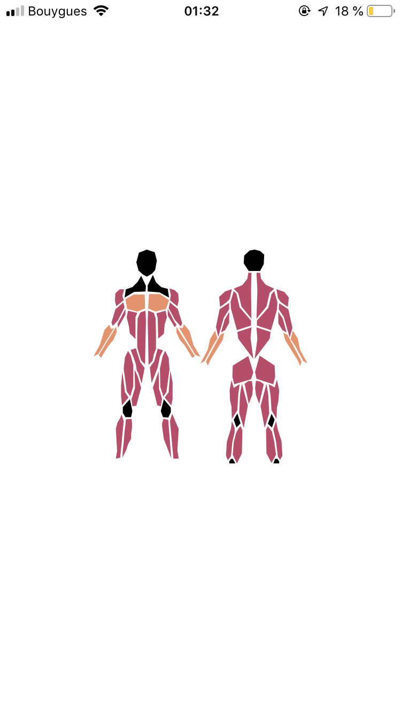

# react-native-body-highlighter

[](https://www.npmjs.com/package/react-native-body-highlighter) [](https://www.npmjs.com/package/react-native-body-highlighter) [](https://www.npmjs.com/package/react-native-body-highlighter)

> Simple body muscles highlighter for react-native.

<div style="text-align: center;">

</div>

## Installation

```bash
$ npm install react-native-body-highlighter --save
```

or use yarn

```bash
$ yarn add react-native-body-highlighter
```

## Usage

Note: If you don't use `Expo`, ensure to add [react-native-svg](https://github.com/react-native-community/react-native-svg) to your project before using this package.

The snippet below shows how the component can be used

```javascript
import React from "react";
import { StyleSheet, Text, View } from "react-native";

import Body from "react-native-body-highlighter";

export default class App extends React.Component {
  render() {
    return (
      <View style={styles.container}>
        <Body
          scale={1}
          data={[
            // Back
            { slug: "trapezius", intensity: 1 },
            { slug: "upper-back", intensity: 1 },
            { slug: "lower-back", intensity: 1 },
            // Chest
            { slug: "chest", intensity: 2 },
            // Arms
            { slug: "biceps", intensity: 1 },
            { slug: "triceps", intensity: 1 },
            { slug: "forearm", intensity: 2 },
            { slug: "back-deltoids", intensity: 1 },
            { slug: "front-deltoids", intensity: 1 },
            // Abs
            { slug: "abs", intensity: 1 },
            { slug: "obliques", intensity: 1 },
            // Legs
            { slug: "adductor", intensity: 1 },
            { slug: "hamstring", intensity: 1 },
            { slug: "quadriceps", intensity: 1 },
            { slug: "abductors", intensity: 1 },
            { slug: "calves", intensity: 1 },
            { slug: "gluteal", intensity: 1 },

            // Others
            { slug: "head", intensity: 0 },
            { slug: "neck", intensity: 0 }
          ]}
        />
      </View>
    );
  }
}

const styles = StyleSheet.create({
  container: {
    flex: 1,
    backgroundColor: "#fff",
    alignItems: "center",
    justifyContent: "center"
  }
});
```

## Props

| Prop  | Required | Purpose                                    |
| ----- | -------- | ------------------------------------------ |
| data  | Yes      | (Array) Array of MuscleObject to highlight |
| scale | No       | (Float) Defaults to 1                      |

## Muscle object model

- #### MucleObject : `{ slug: MuscleName, intensity: IntensityNumber }`

- #### MuscleName : Muscle name to highlight (See the list of available muscles below)

- #### IntensityNumber : Color of highlight (0 = black, 1 = red, 2 = yellow)

## List of muscles

```Javascript
trapezius
upper-back
lower-back
chest
biceps
triceps
forearm
back-deltoids
front-deltoids
abs
obliques
adductor
hamstring
quadriceps
abductors
calves
gluteal
head
neck
```
