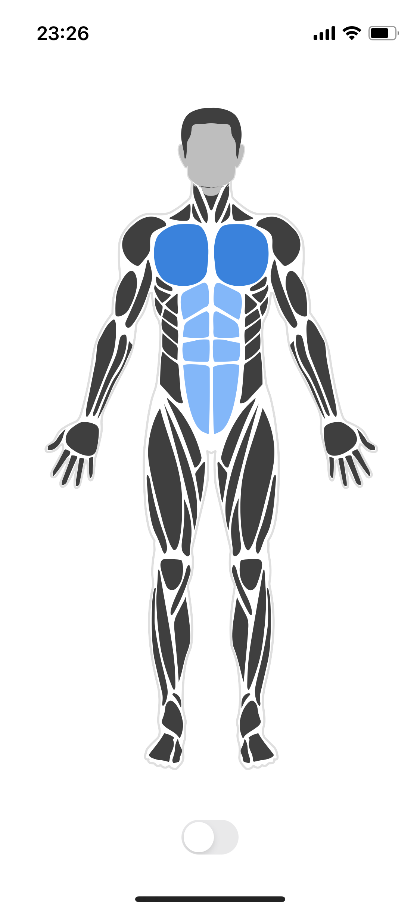
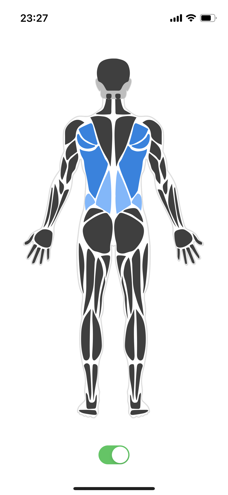

# react-native-body-highlighter

[](https://www.npmjs.com/package/react-native-body-highlighter) [](https://www.npmjs.com/package/react-native-body-highlighter)
[](https://circleci.com/gh/HichamELBSI/react-native-body-highlighter)

> SVG human body bodyParts highlighter for react-native.

<div style="text-align:center;width:100%;">
  
  
</div>

## Installation

```bash
$ npm install react-native-body-highlighter --save
```

or use yarn

```bash
$ yarn add react-native-body-highlighter
```

## Usage

Note: If you don't use `Expo`, ensure to add [react-native-svg](https://github.com/react-native-community/react-native-svg) to your project before using this package.

The snippet below shows how the component can be used

```jsx
import { StyleSheet, Switch, View } from "react-native";
import { useState } from "react";
import Body from "react-native-body-highlighter";

export default function App() {
  const [bodyPartSelected, setBodyPartSelected] = useState({
    slug: "biceps",
    intensity: 2,
  });
  const [isBackSideEnabled, setsetIsBackSideEnabled] = useState(false);
  const toggleSwitch = () =>
    setsetIsBackSideEnabled((previousState) => !previousState);

  return (
    <View style={styles.container}>
      <Body
        data={[
          { slug: "chest", intensity: 1 },
          { slug: "abs", intensity: 2 },
          { slug: "upper-back", intensity: 1 },
          { slug: "lower-back", intensity: 2 },
          bodyPartSelected,
        ]}
        onBodyPartPress={(e) =>
          setBodyPartSelected({ slug: e.slug, intensity: 2 })
        }
        side={isBackSideEnabled ? "back" : "front"}
        scale={1.7}
      />
      <Switch onValueChange={toggleSwitch} value={isBackSideEnabled} />
      <StatusBar style="auto" />
    </View>
  );
}

const styles = StyleSheet.create({
  container: {
    flex: 1,
    backgroundColor: "#fff",
    alignItems: "center",
    justifyContent: "center",
  },
});
```

## v3.X.X Props

| Prop            | Required | Purpose                                                                               |
| --------------- | -------- | ------------------------------------------------------------------------------------- |
| data            | Yes      | `BodyPartObject[]` Array of `BodyPartObject` to highlight                             |
| onBodyPartPress | No       | `Func` - (bodyPart: BodyPartObject) => {} Callback called when a user tap a body part |
| colors          | No       | `String[]` - Defaults to `['#0984e3', '#74b9ff']`                                     |
| side            | No       | `String` - Can be "back" or "front" Display only the front, Defaults to `front`       |
| backOnly        | No       | (Boolean) Display only the back, Defaults to `false`                                  |
| scale           | No       | (Float) Defaults to `1`                                                               |

## v2.X.X Props

| Prop            | Required | Purpose                                                                                                                     |
| --------------- | -------- | --------------------------------------------------------------------------------------------------------------------------- |
| data            | Yes      | (Array) Array of `BodyPartObject` to highlight                                                                              |
| onBodyPartPress | No       | (Func) (bodyPart: BodyPartObject) => {} Callback called when a user tap a body part, disabled if zoomOnPress is set to true |
| colors          | No       | (Array) Defaults to `['#0984e3', '#74b9ff']`                                                                                |
| frontOnly       | No       | (Boolean) Display only the front, Defaults to `false`                                                                       |
| backOnly        | No       | (Boolean) Display only the back, Defaults to `false`                                                                        |
| zoomOnPress     | No       | (Boolean) Defaults to false                                                                                                 |
| scale           | No       | (Float) Defaults to `1`                                                                                                     |

## BodyPart object model

- #### BodyPartObject : `{ slug: BodyPartName, intensity: IntensityNumber }`

- #### BodyPartName : Body part name to highlight (See the list of available body parts below)

- #### IntensityNumber : Color intensity (if the `colors` property is set: from 1 to `colors.length` + 1. If not, intensity can be 1 or 2)

## List of body parts

| BodyParts       | v2                 | v3                 | Side  |
| --------------- | ------------------ | ------------------ | ----- |
| trapezius       | :white_check_mark: | :white_check_mark: | Both  |
| upper-back      | :white_check_mark: | :white_check_mark: | Back  |
| lower-back      | :white_check_mark: | :white_check_mark: | Back  |
| chest           | :white_check_mark: | :white_check_mark: | Front |
| biceps          | :white_check_mark: | :white_check_mark: | Front |
| triceps         | :white_check_mark: | :white_check_mark: | Both  |
| forearm         | :white_check_mark: | :white_check_mark: | Both  |
| forearm         | :white_check_mark: | :white_check_mark: | Both  |
| back-deltoids   | :white_check_mark: | :x:                | Back  |
| front-deltoids  | :white_check_mark: | :x:                | Front |
| deltoids        | :x:                | :white_check_mark: | Both  |
| abs             | :white_check_mark: | :white_check_mark: | Front |
| obliques        | :white_check_mark: | :white_check_mark: | Both  |
| adductor        | :white_check_mark: | :x:                | Both  |
| adductors       | :white_check_mark: | :white_check_mark: | Both  |
| hamstring       | :white_check_mark: | :white_check_mark: | Back  |
| abductors       | :white_check_mark: | :x:                | Front |
| calves          | :white_check_mark: | :white_check_mark: | Both  |
| gluteal         | :white_check_mark: | :white_check_mark: | Back  |
| head            | :white_check_mark: | :white_check_mark: | Both  |
| neck            | :white_check_mark: | :white_check_mark: | Both  |
| feet            | :x:                | :white_check_mark: | Both  |
| ankles          | :x:                | :white_check_mark: | Both  |
| tibialis        | :x:                | :white_check_mark: | Both  |
| hands           | :x:                | :white_check_mark: | Both  |
