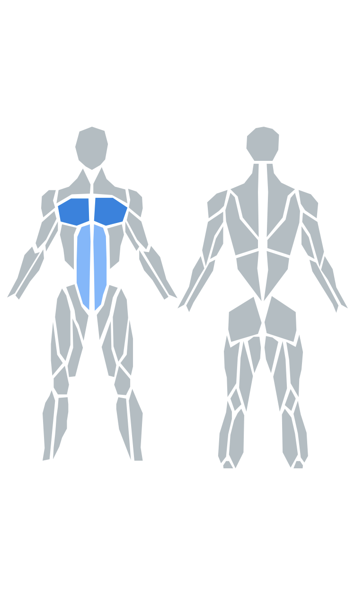

# react-native-body-highlighter

[](https://www.npmjs.com/package/react-native-body-highlighter) [](https://www.npmjs.com/package/react-native-body-highlighter)
[](https://circleci.com/gh/HichamELBSI/react-native-body-highlighter)

> SVG human body muscles highlighter for react-native.

<div style="text-align:center;width:100%;">
  
</div>

## Installation

```bash
$ npm install react-native-body-highlighter --save
```

or use yarn

```bash
$ yarn add react-native-body-highlighter
```

## Usage

Note: If you don't use `Expo`, ensure to add [react-native-svg](https://github.com/react-native-community/react-native-svg) to your project before using this package.

The snippet below shows how the component can be used

```jsx
import Body from "react-native-body-highlighter";

const data = [
  { slug: "chest", intensity: 1 },
  { slug: "abs", intensity: 2 },
];

export default function App() {
  return (
    <View>
      <Body data={data} />
    </View>
  );
}
```

## Props

| Prop          | Required | Purpose                                                                                                              |
| ------------- | -------- | -------------------------------------------------------------------------------------------------------------------- |
| data          | Yes      | (Array) Array of `MuscleObject` to highlight                                                                         |
| onMusclePress | No       | (Func) (muscle: MuscleObject) => {} Callback called when a user tap a muscle, disabled if zoomOnPress is set to true |
| colors        | No       | (Array) Defaults to `['#0984e3', '#74b9ff']`                                                                         |
| frontOnly     | No       | (Boolean) Display only the front, Defaults to `false`                                                                |
| backOnly      | No       | (Boolean) Display only the back, Defaults to `false`                                                                 |
| zoomOnPress   | No       | (Boolean) Defaults to false                                                                                          |
| scale         | No       | (Float) Defaults to `1`                                                                                              |

## Muscle object model

- #### MucleObject : `{ slug: MuscleName, intensity: IntensityNumber }`

- #### MuscleName : Muscle name to highlight (See the list of available muscles below)

- #### IntensityNumber : Color intensity (if the `colors` property is set: from 1 to `colors.length` + 1. If not, intensity can be 1 or 2)

## List of muscles

```Javascript
// Back
trapezius
upper-back
lower-back

// Chest
chest

// Arms
biceps
triceps
forearm
back-deltoids
front-deltoids

// Abs
abs
obliques

// Legs
adductor
hamstring
quadriceps
abductors
calves
gluteal

// Head
head
neck
```
