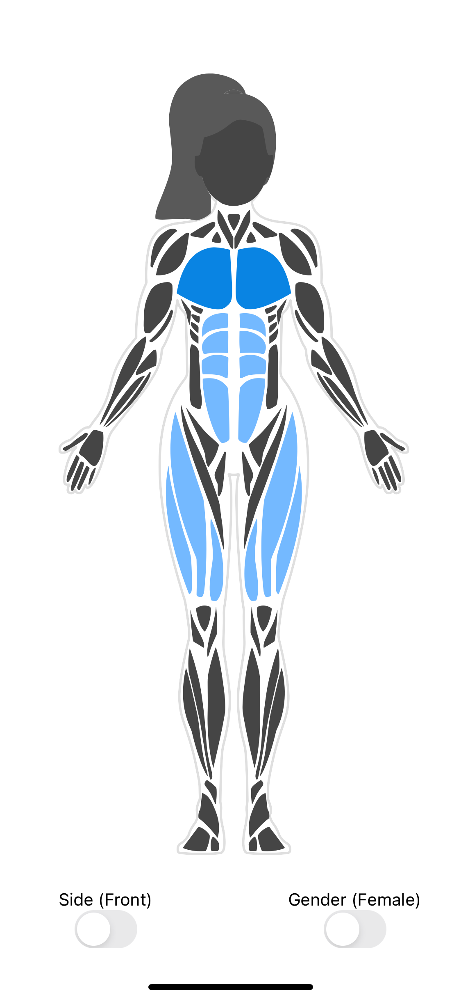
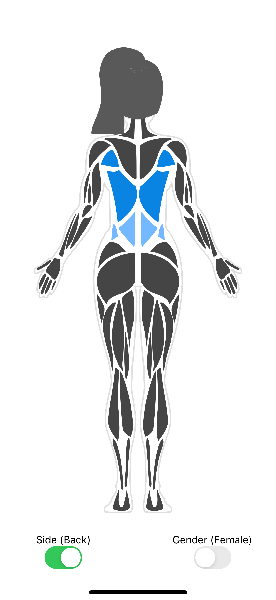
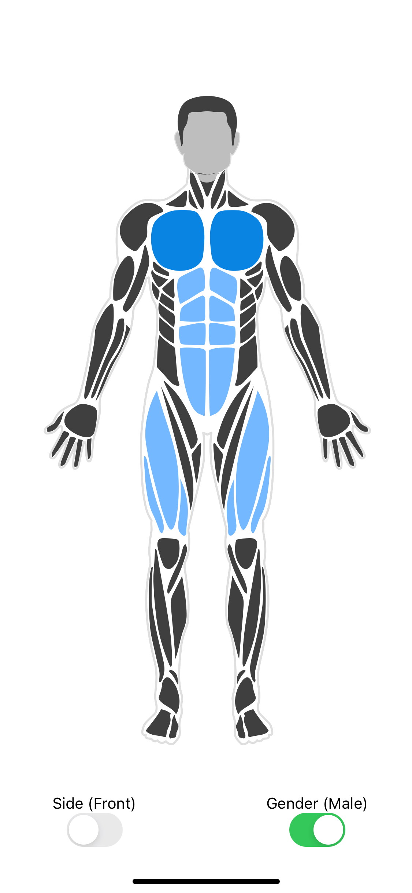
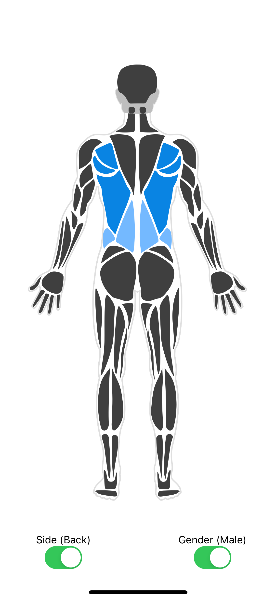

# react-native-body-highlighter

[](https://www.npmjs.com/package/react-native-body-highlighter) [](https://www.npmjs.com/package/react-native-body-highlighter)
[](https://circleci.com/gh/HichamELBSI/react-native-body-highlighter)

> SVG human body parts highlighter for react-native (Expo compatible).

<div style="text-align:center;width:100%;">
  
  
  
  
</div>

## Installation

npm

```bash
$ npm install react-native-body-highlighter
```

yarn

```bash
$ yarn add react-native-body-highlighter
```

## Usage

### Basic example

```jsx
import { useState } from "react";
import Body from "react-native-body-highlighter";

export default function App() {
  return (
    <View style={styles.container}>
      <Body
        data={[
          { slug: "chest", intensity: 1 },
          { slug: "abs", intensity: 2 },
        ]}
        gender="female"
        side="front"
        scale={1.7}
        withBorder
      />
    </View>
  );
}

const styles = StyleSheet.create({
  container: {
    flex: 1,
    backgroundColor: "#fff",
    alignItems: "center",
    justifyContent: "center",
  },
});
```

<details>
<summary style="font-size:18px; font-weight: bold;">Complete example</summary>
<p>

```jsx
import { StyleSheet, Switch, Text, View } from "react-native";
import { useState } from "react";
import Body from "react-native-body-highlighter";

export default function App() {
  const [bodyPartSelected, setBodyPartSelected] = useState({
    slug: "biceps",
    intensity: 2,
  });
  const [isBackSideEnabled, setIsBackSideEnabled] = useState(false);
  const [isMale, setIsMale] = useState(true);
  const toggleSwitch = () =>
    setIsBackSideEnabled((previousState) => !previousState);

  const toggleGenderSwitch = () => setIsMale((previousState) => !previousState);

  return (
    <View style={styles.container}>
      <Body
        data={[
          { slug: "chest", intensity: 1 },
          { slug: "abs", intensity: 2 },
          { slug: "upper-back", intensity: 1 },
          { slug: "lower-back", intensity: 2 },
          bodyPartSelected,
        ]}
        onBodyPartPress={(e) =>
          setBodyPartSelected({ slug: e.slug, intensity: 2 })
        }
        gender={isMale ? "male" : "female"}
        side={isBackSideEnabled ? "back" : "front"}
        scale={1.7}
        withBorder
      />
      <View style={styles.switchContainer}>
        <View style={styles.switch}>
          <Text>Side ({isBackSideEnabled ? "Back" : "Front"})</Text>
          <Switch onValueChange={toggleSwitch} value={isBackSideEnabled} />
        </View>
        <View style={styles.switch}>
          <Text>Gender ({isMale ? "Male" : "Female"})</Text>
          <Switch onValueChange={toggleGenderSwitch} value={isMale} />
        </View>
      </View>
    </View>
  );
}

const styles = StyleSheet.create({
  container: {
    flex: 1,
    backgroundColor: "#fff",
    alignItems: "center",
    justifyContent: "center",
  },
  switchContainer: {
    flexDirection: "row",
    gap: 30,
  },
  switch: {
    flex: 1,
    alignItems: "center",
    justifyContent: "center",
  },
});
```

</p>
</details>

## v3.X.X Props

| Prop            | Required | Purpose                                                                                                                  |
| --------------- | -------- | ------------------------------------------------------------------------------------------------------------------------ |
| data            | Yes      | `BodyPartObject[]` - Array of `BodyPartObject` to highlight                                                              |
| onBodyPartPress | No       | `Func` - (bodyPart: BodyPartObject) => {} Callback called when a user tap a body part                                    |
| colors          | No       | `String[]` - Defaults to `['#0984e3', '#74b9ff']`                                                                        |
| side            | No       | `string` - Can be "back" or "front", Defaults to `front`                                                                 |
| gender          | No       | `string` - Can be "male" or "female", Defaults to `male` - :warning: Please consider `female` as a beta work in progress |
| scale           | No       | `Float` - Defaults to `1`                                                                                                |
| withBorder      | No       | `Boolean` - Defaults to `true`                                                                                           |

## v2.X.X Props

| Prop          | Required | Purpose                                                                                                                     |
| ------------- | -------- | --------------------------------------------------------------------------------------------------------------------------- |
| data          | Yes      | (Array) Array of `BodyPartObject` to highlight                                                                              |
| onMusclePress | No       | (Func) (bodyPart: BodyPartObject) => {} Callback called when a user tap a body part, disabled if zoomOnPress is set to true |
| colors        | No       | (Array) Defaults to `['#0984e3', '#74b9ff']`                                                                                |
| frontOnly     | No       | (Boolean) Display only the front, Defaults to `false`                                                                       |
| backOnly      | No       | (Boolean) Display only the back, Defaults to `false`                                                                        |
| zoomOnPress   | No       | (Boolean) Defaults to false                                                                                                 |
| scale         | No       | (Float) Defaults to `1`                                                                                                     |

## BodyPart object model

- #### BodyPartObject : `{ slug: BodyPartName, intensity: IntensityNumber }`

- #### BodyPartName : Body part name to highlight (See the list of available body parts below)

- #### IntensityNumber : Color intensity (if the `colors` property is set: from 1 to `colors.length` + 1. If not, intensity can be 1 or 2)

## List of body parts

| BodyParts       | v2                 | v3                 | Side  |
| --------------- | ------------------ | ------------------ | ----- |
| trapezius       | :white_check_mark: | :white_check_mark: | Both  |
| triceps         | :white_check_mark: | :white_check_mark: | Both  |
| forearm         | :white_check_mark: | :white_check_mark: | Both  |
| obliques        | :white_check_mark: | :white_check_mark: | Both  |
| adductors       | :white_check_mark: | :white_check_mark: | Both  |
| calves          | :white_check_mark: | :white_check_mark: | Both  |
| head            | :white_check_mark: | :white_check_mark: | Both  |
| neck            | :white_check_mark: | :white_check_mark: | Both  |
| chest           | :white_check_mark: | :white_check_mark: | Front |
| biceps          | :white_check_mark: | :white_check_mark: | Front |
| abs             | :white_check_mark: | :white_check_mark: | Front |
| upper-back      | :white_check_mark: | :white_check_mark: | Back  |
| lower-back      | :white_check_mark: | :white_check_mark: | Back  |
| hamstring       | :white_check_mark: | :white_check_mark: | Back  |
| gluteal         | :white_check_mark: | :white_check_mark: | Back  |
| deltoids        | :x:                | :white_check_mark: | Both  |
| hands           | :x:                | :white_check_mark: | Both  |
| feet            | :x:                | :white_check_mark: | Both  |
| ankles          | :x:                | :white_check_mark: | Both  |
| tibialis        | :x:                | :white_check_mark: | Both  |
| adductor        | :white_check_mark: | :x:                | Both  |
| front-deltoids  | :white_check_mark: | :x:                | Front |
| abductors       | :white_check_mark: | :x:                | Front |
| back-deltoids   | :white_check_mark: | :x:                | Back  |
